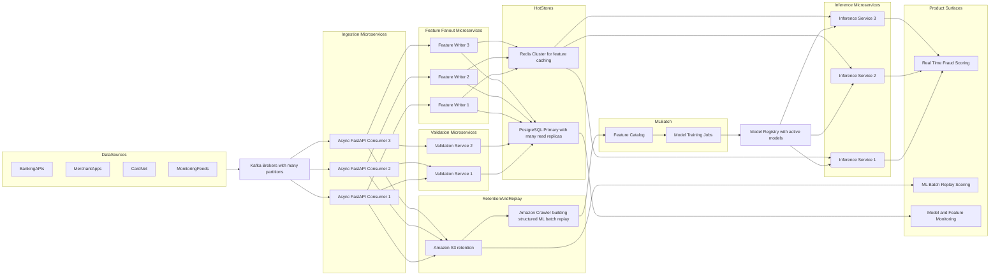

# Architecture diagram

```mermaid
flowchart LR

    subgraph DataSources
        BankingAPIs
        MerchantApps
        CardNet
        MonitoringFeeds
    end

    DataSources --> KafkaIngest["Kafka Brokers with many partitions"]

    subgraph IngestionMicroservices["Ingestion Microservices"]
        IM1["Async FastAPI Consumer 1"]
        IM2["Async FastAPI Consumer 2"]
        IM3["Async FastAPI Consumer 3"]
    end

    KafkaIngest --> IM1
    KafkaIngest --> IM2
    KafkaIngest --> IM3

    subgraph ValidationMicroservices["Validation Microservices"]
        VM1["Validation Service 1"]
        VM2["Validation Service 2"]
    end

    IM1 --> VM1
    IM2 --> VM1
    IM3 --> VM2

    subgraph FeatureMicroservices["Feature Fanout Microservices"]
        FM1["Feature Writer 1"]
        FM2["Feature Writer 2"]
        FM3["Feature Writer 3"]
    end

    IM1 --> FM1
    IM2 --> FM2
    IM3 --> FM3

    subgraph HotStores
        RedisCluster["Redis Cluster for feature caching"]
        PGXCluster["PostgreSQL Primary with many read replicas"]
    end

    FM1 --> RedisCluster
    FM2 --> RedisCluster
    FM3 --> RedisCluster

    VM1 --> PGXCluster
    VM2 --> PGXCluster
    FM1 --> PGXCluster
    FM2 --> PGXCluster
    FM3 --> PGXCluster

    subgraph RetentionAndReplay
        S3Archive["Amazon S3 retention"]
        Crawler["Amazon Crawler building structured ML batch replay"]
    end

    IM1 --> S3Archive
    IM2 --> S3Archive
    IM3 --> S3Archive
    S3Archive --> Crawler

    subgraph MLBatch
        Catalog["Feature Catalog"]
        Trainer["Model Training Jobs"]
    end

    Crawler --> Catalog
    Catalog --> Trainer

    subgraph InferenceMicroservices["Inference Microservices"]
        INF1["Inference Service 1"]
        INF2["Inference Service 2"]
        INF3["Inference Service 3"]
    end

    Trainer --> ModelRegistry["Model Registry with active models"]
    ModelRegistry --> INF1
    ModelRegistry --> INF2
    ModelRegistry --> INF3

    RedisCluster --> INF1
    RedisCluster --> INF2
    RedisCluster --> INF3

    subgraph ProductSurfaces["Product Surfaces"]
        RealTimeScoring["Real Time Fraud Scoring"]
        MLReplay["ML Batch Replay Scoring"]
        FeatureMonitoring["Model and Feature Monitoring"]
    end

    INF1 --> RealTimeScoring
    INF2 --> RealTimeScoring
    INF3 --> RealTimeScoring

    S3Archive --> MLReplay
    PGXCluster --> FeatureMonitoring
```
